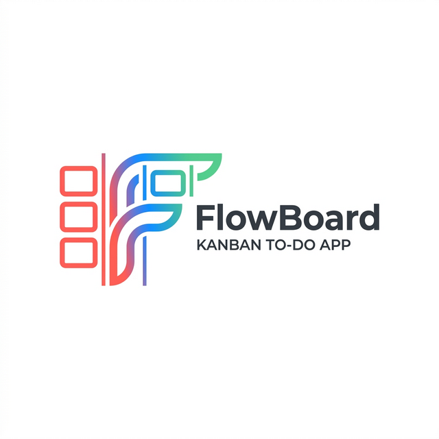
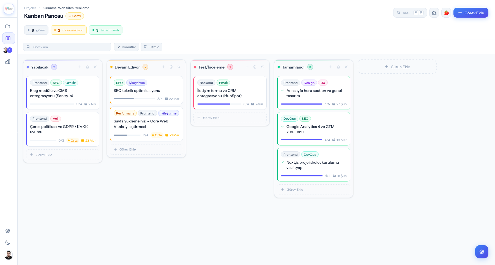
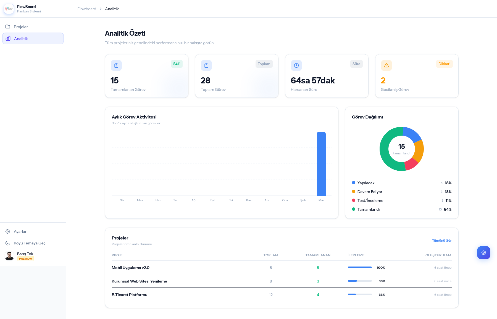
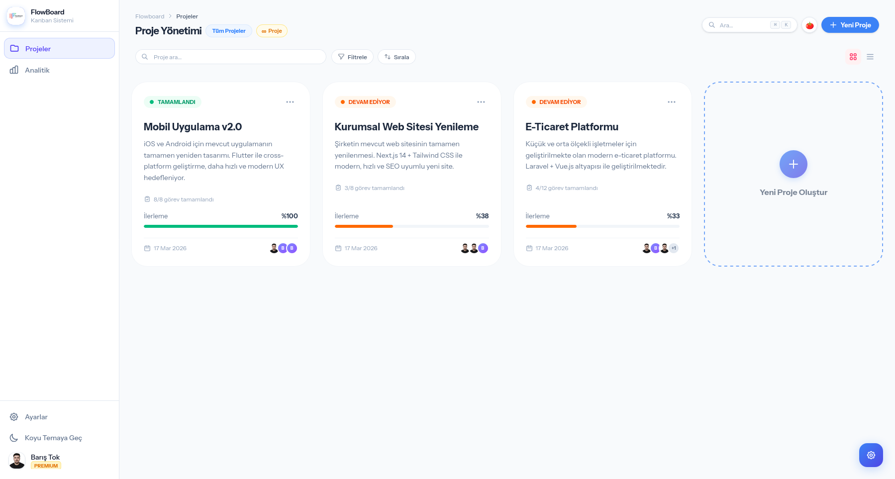
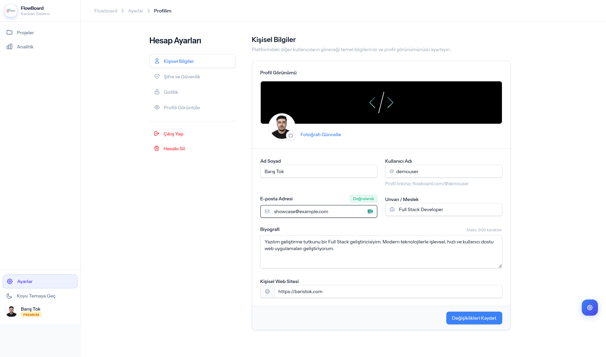
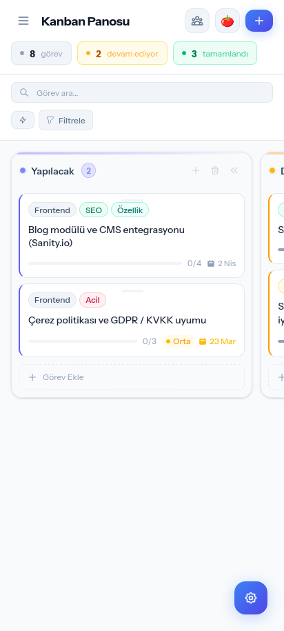

**A modern Kanban-based project management application**
**Modern Kanban tabanlı proje yönetim uygulaması**

 

 

**[🚀 Live Demo](https://flowboard.baristok.com)** &nbsp;•&nbsp; **[🇬🇧 English](#-english)** &nbsp;•&nbsp; **[🇹🇷 Türkçe](#-türkçe)**

---

## 🇬🇧 English

### About

FlowBoard is a full-featured Kanban project management application built with Laravel 12. It allows individuals and teams to organize work visually on Kanban boards, collaborate in real-time, track time with a built-in Pomodoro timer, and analyze productivity through detailed dashboards.

### ✨ Features

#### 📋 Kanban Board
- Drag-and-drop task cards between columns
- Customizable columns with color coding
- Auto-created default columns: *To Do*, *In Progress*, *Review*, *Done*
- Column reordering and protection

#### ✅ Task Management
- Tasks with title, description, urgency level, and due dates
- Subtasks (checklists) with progress tracking
- Color-coded tags and labels
- Comments and discussion threads
- Built-in time tracker (seconds precision)

#### 👥 Team Collaboration
- Invite team members via single-use secure tokens
- Role-based access: **Owner**, **Admin**, **Member**
- Per-project member management

#### ⏱️ Pomodoro Timer
- Built-in Pomodoro productivity timer
- Work / break session tracking
- Session history and time summaries

#### 📊 Analytics Dashboard
- Task completion statistics
- Monthly task creation trends (12-month chart)
- Column distribution (donut chart)
- Overdue task tracking
- Time-spent reporting

#### 🔐 Authentication
- Email & password registration/login
- Email verification required
- OAuth social login: **Google**, **Microsoft**
- Password reset flow

#### 💎 Plans
- **Free tier:** 3 projects, 50 tasks/project, 5 team members
- **Premium tier:** Unlimited projects, tasks, and members

#### 🎨 UI / UX
- Dark & Light theme (persisted in localStorage)
- Fully responsive — mobile, tablet, desktop
- Command palette (`Ctrl+K` / `Cmd+K`)
- Toast notifications
- Turkish localized interface

---

### 🛠️ Tech Stack

| Layer | Technology |
|-------|-----------|
| Backend | Laravel 12, PHP 8.5 |
| Frontend | Alpine.js v3, Tailwind CSS v4 |
| Database | MySQL 8 |
| Authentication | Laravel session + Laravel Socialite |
| Social OAuth | Google, GitHub, Microsoft |
| Dev Environment | Docker |
| Code Quality | Laravel Pint, PHPUnit 11 |

---

### 📸 Screenshots

| Kanban Board | Analytics |
|---|---|
|  |  |

| Projects List | User Profile |
|---|---|
|  |  |

📱 Mobile View

---

### 🚀 Demo

Try the live demo: **[flowboard.baristok.com](https://flowboard.baristok.com)**

---

## 🇹🇷 Türkçe

### Hakkında

FlowBoard, Laravel 12 ile geliştirilmiş, tam özellikli bir Kanban proje yönetim uygulamasıdır. Bireyler ve ekipler; görevlerini görsel Kanban panolarında organize edebilir, ekip arkadaşlarıyla iş birliği yapabilir, dahili Pomodoro zamanlayıcıyla zaman takibi yapabilir ve analitik panolar üzerinden verimliliklerini analiz edebilir.

### ✨ Özellikler

#### 📋 Kanban Panosu
- Sütunlar arasında sürükle-bırak kart taşıma
- Renk kodlamalı, özelleştirilebilir sütunlar
- Otomatik oluşturulan varsayılan sütunlar: *Yapılacak*, *Devam Ediyor*, *İnceleme*, *Tamamlandı*
- Sütun sıralama ve koruma

#### ✅ Görev Yönetimi
- Başlık, açıklama, aciliyet seviyesi ve son tarih
- Alt görevler (kontrol listeleri) ve ilerleme takibi
- Renk kodlamalı etiketler
- Yorum ve tartışma akışı
- Dahili zaman takibi (saniye hassasiyetinde)

#### 👥 Takım İş Birliği
- Tek kullanımlık güvenli token'larla davet sistemi
- Rol tabanlı erişim: **Sahip**, **Yönetici**, **Üye**
- Proje bazlı üye yönetimi

#### ⏱️ Pomodoro Zamanlayıcı
- Dahili Pomodoro üretkenlik zamanlayıcısı
- Çalışma / mola oturumu takibi
- Oturum geçmişi ve zaman özetleri

#### 📊 Analitik Panosu
- Görev tamamlama istatistikleri
- Aylık görev oluşturma trendleri (12 aylık grafik)
- Sütun dağılımı (halka grafik)
- Gecikmiş görev takibi
- Harcanan zaman raporlama

#### 🔐 Kimlik Doğrulama
- E-posta ve şifre ile kayıt/giriş
- E-posta doğrulama zorunluluğu
- OAuth sosyal giriş: **Google**, **Microsoft**
- Şifre sıfırlama akışı

#### 💎 Planlar
- **Ücretsiz:** 3 proje, 50 görev/proje, 5 takım üyesi
- **Premium:** Sınırsız proje, görev ve üye

#### 🎨 Arayüz / UX
- Karanlık & Açık tema (localStorage ile kalıcı)
- Tam responsive — mobil, tablet, masaüstü
- Komut paleti (`Ctrl+K` / `Cmd+K`)
- Toast bildirimleri
- Türkçe arayüz

---

### 🛠️ Teknoloji Yığını

| Katman | Teknoloji |
|--------|-----------|
| Backend | Laravel 12, PHP 8.5 |
| Frontend | Alpine.js v3, Tailwind CSS v4 |
| Veritabanı | MySQL 8 |
| Kimlik Doğrulama | Laravel session + Laravel Socialite |
| Sosyal OAuth | Google, GitHub, Microsoft |
| Geliştirme Ortamı | Docker |
| Kod Kalitesi | Laravel Pint, PHPUnit 11 |

---

### 📸 Ekran Görüntüleri

> `docs/screenshots/` klasörüne ekran görüntülerinizi ekleyin, burada görünür olacaklar.

| Kanban Panosu | Analitik |
|---|---|
|  |  |

| Projeler Listesi | Kullanıcı Profili |
|---|---|
|  |  |

📱 Mobil Görünüm

---

Built with ❤️ using [Laravel](https://laravel.com)

